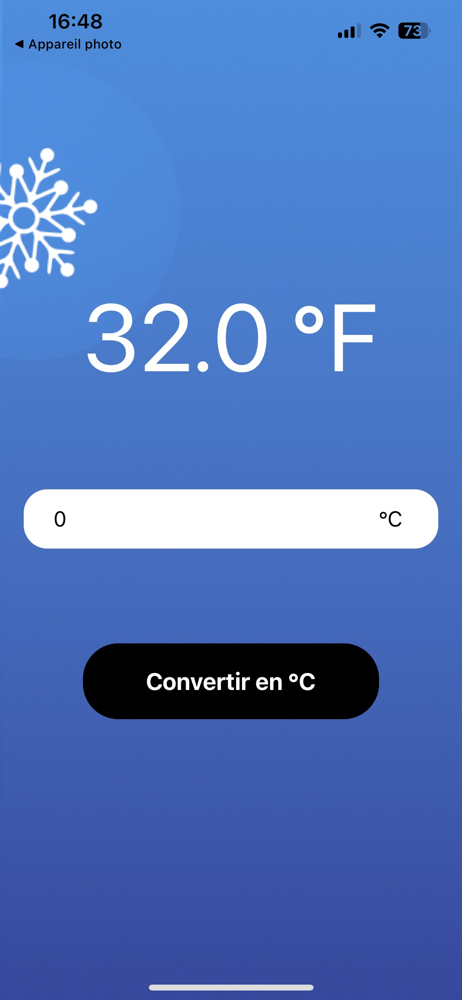
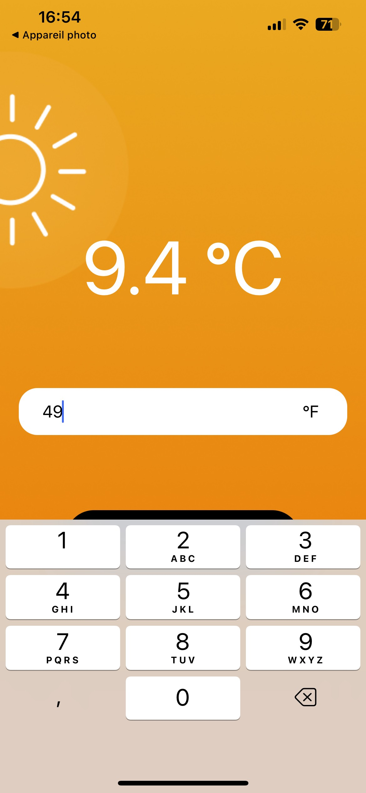

# Temperature Converter (React Native)

This is a small project built during the course [_React Native – Le Guide du Débutant_](https://www.udemy.com/course/react-native-le-guide-du-debutant/).  
The app is a simple **temperature converter** (Celsius ↔ Fahrenheit) built with React Native and Expo.

## 🖼️ Screenshots

<p align="center">
  
  &nbsp;&nbsp;&nbsp;
  
</p>

_Conversion Celsius ↔ Fahrenheit_

## 🚀 Getting Started

### Prerequisites

- Node.js installed
- Expo CLI (you can install it via `npm install –g expo-cli`)
- A device or simulator/emulator to run the app

### Installation

1. Clone this repository

2. Install dependencies

   ```bash
   npm install
   # or
   yarn install
   ```

3. Start the app using Expo

   ```bash
   npx expo start
   ```

   Then follow the instructions (scan the QR code with Expo Go app, or run on iOS/Android simulator).

## 🧪 What’s inside

- A main screen where you enter a temperature in Celsius or Fahrenheit
- The conversion logic (Celsius to Fahrenheit and vice versa)
- Basic styling and layout to keep it simple and clean
- Code structured for learning purposes

## 🎯 Learning Goals

- Understand the basics of React Native (components, state, props)
- Use Expo to bootstrap and run a React Native app quickly
- Create a simple, functional UI
